# Wiring the Elegoo 37-in-1 Sensor Kit to an ESP32-C3 SuperMini

A guide for wiring every module in the [Elegoo 37-in-1 sensor kit](https://www.amazon.com/ELEGOO-Upgraded-Tutorial-Compatible-MEGA2560/dp/B01MG49ZQ5/) to an [ESP32-C3 SuperMini](https://www.amazon.com/ESP32-C3-Development-Bluetooth-Running-Frequency/dp/B0DFWG87JS/). It's a rewrite of Elegoo's original UNO / Mega documentation ([tutorial](https://www.elegoo.com/blogs/arduino-projects/elegoo-upgraded-37-in-1-sensor-modules-kit-tutorial), [product page](https://us.elegoo.com/products/elegoo-37-in-1-sensor-kit)) — same modules, different board, simpler text.

## Contents

- [What you need](#what-you-need)
- [About the ESP32-C3 SuperMini](#about-the-esp32-c3-supermini)
- [How to read this guide](#how-to-read-this-guide)
- **Input modules**
  - [Button](#button)
  - [Shock switch](#shock-switch)
  - [Tilt switch (ball)](#tilt-switch-ball)
  - [Tilt switch (mercury)](#tilt-switch-mercury)
  - [Reed switch (large)](#reed-switch-large)
  - [Mini reed switch](#mini-reed-switch)
  - [Metal touch](#metal-touch)
  - [Joystick](#joystick)
  - [Photoresistor](#photoresistor)
  - [Photo-interrupter](#photo-interrupter)
  - [Flame sensor](#flame-sensor)
  - [Digital hall sensor](#digital-hall-sensor)
  - [Linear (analog) hall sensor](#linear-analog-hall-sensor)
  - [Analog thermistor](#analog-thermistor)
  - [Digital thermistor (thresholded)](#digital-thermistor-thresholded)
  - [Line tracker](#line-tracker)
  - [IR receiver](#ir-receiver)
  - [DHT temperature & humidity](#dht-temperature--humidity)
  - [DS18B20 digital temperature](#ds18b20-digital-temperature)
  - [Sound sensor (sensitive microphone)](#sound-sensor-sensitive-microphone)
  - [Sound sensor (small microphone)](#sound-sensor-small-microphone)
- **Output modules**
  - [Active buzzer](#active-buzzer)
  - [Passive buzzer](#passive-buzzer)
  - [Laser](#laser)
  - [SMD RGB LED](#smd-rgb-led)
  - [RGB LED (through-hole)](#rgb-led-through-hole)
  - [Dual-color LED](#dual-color-led)
  - [Magic light cup](#magic-light-cup)
  - [IR emitter](#ir-emitter)
  - [1-channel relay](#1-channel-relay)

## What you need

- An [ESP32-C3 SuperMini](https://www.amazon.com/ESP32-C3-Development-Bluetooth-Running-Frequency/dp/B0DFWG87JS/)
- The [Elegoo 37-in-1 sensor kit](https://www.amazon.com/ELEGOO-Upgraded-Tutorial-Compatible-MEGA2560/dp/B01MG49ZQ5/)
- A soldering iron and solder (for headers on the modules that ship without them)
- Jumper wires and a breadboard for initial testing

## About the ESP32-C3 SuperMini

The ESP32-C3 SuperMini is a small Wi-Fi / Bluetooth microcontroller board built around Espressif's ESP32-C3 chip. A few things to know before you wire anything up:

- **3.3 V logic.** The board runs at 3.3 V. Most Elegoo modules are happy on 3.3 V even if their silkscreen says 5 V; a few (like the relay) really do want 5 V, and those are called out per module.
- **Power pins.** `3V3` and `GND` are the ones you'll use most. `5V` is also available (from the USB-C port).
- **Signal pins (GPIOs).** The board exposes pins labelled `GPIO0` through `GPIO21` (with some gaps). Most of them can do digital input or output; a handful can also read analog voltages.
- **Analog pins.** Only `GPIO0`, `GPIO1`, `GPIO2`, `GPIO3`, and `GPIO4` can read an analog voltage. Everything else is digital-only.
- **PWM.** Any GPIO can produce a PWM (pulse-width-modulation) signal for dimming LEDs, playing tones on a buzzer, or driving a servo.
- **Boot-sensitive pins.** A handful of pins (`GPIO0`, `GPIO2`, `GPIO8`, `GPIO9`) are read by the chip at power-up to decide how to start. If your wiring happens to hold one of these pins at the "wrong" voltage when you plug in the board, the board may refuse to boot. Prefer other pins for inputs when you have a choice; outputs on these pins are usually fine.
- **Reserved pins.** `GPIO11`–`GPIO17` are wired internally to the flash memory — **don't use them.** `GPIO18` and `GPIO19` are used by the USB-C port — leave them alone unless you know you don't need USB.
- **Safe-to-use digital pins.** `GPIO3`, `GPIO4`, `GPIO5`, `GPIO6`, `GPIO7`, `GPIO10`, `GPIO20`, `GPIO21`.

See the image of the board in `prototypes/electronics/esp32-c3-supermini/esp32-c3-gpios.jpeg` for the physical pin layout.

## How to read this guide

Each module section has three parts:

1. **Description** — what the module is and typical uses.
2. **Wiring diagram** — how to connect it to the ESP32-C3.
3. **Compatible pins** — which ESP32-C3 pins you can use for the module's signal.

Every wiring diagram shows a **default** pin; you can swap in any pin from the module's "Compatible pins" list to free up pins for other modules on the same board.

---

## Input modules

### Button

A momentary push-button breakout (Elegoo KY-004). Pressing the button connects the signal pin to ground; a resistor on the board holds the line high when the button is released. Your code reads one pin: **HIGH when idle, LOW when pressed.**

Typical uses: prop triggers, player-facing "go" buttons, hidden reset / arming switches.

3-pin module (`S`, middle = power, `-`). The middle pin's position varies by batch — check the silkscreen.

#### Wiring

| Module pin | ESP32-C3 pin | Notes                                            |
|------------|--------------|--------------------------------------------------|
| middle     | `3V3`        | 3.3 V. The module also accepts 5 V.              |
| `-`        | `GND`        |                                                  |
| `S`        | `GPIO3` (default) | Reads HIGH when released, LOW when pressed. |

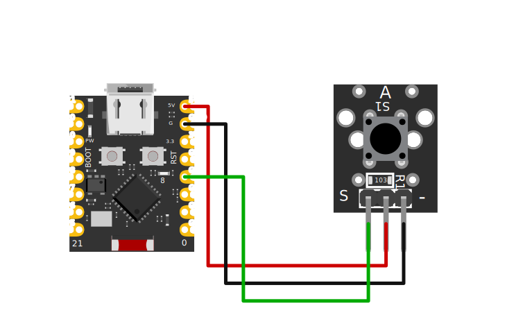

#### Compatible pins

Any safe-to-use digital pin: **`GPIO3`, `GPIO4`, `GPIO5`, `GPIO6`, `GPIO7`, `GPIO10`, `GPIO20`, `GPIO21`**. Avoid the boot-sensitive pins (`GPIO0` / `GPIO2` / `GPIO8` / `GPIO9`) — a button's idle state can keep the board from starting.

### Shock switch

A vibration / knock sensor (Elegoo KY-002). A spring-loaded contact inside the module briefly closes when the module is tapped or jolted. It reads HIGH most of the time and dips LOW for a few milliseconds on each hit. Pulses are short — catch them with an interrupt or a fast polling loop, not a lazy `delay()`.

Typical uses: knock-to-trigger props, tamper detection, "guest kicked the box" effects.

3-pin module (`S`, middle = power, `-`).

#### Wiring

| Module pin | ESP32-C3 pin | Notes                                       |
|------------|--------------|---------------------------------------------|
| middle     | `3V3`        | 3.3 V. Also accepts 5 V.                    |
| `-`        | `GND`        |                                             |
| `S`        | `GPIO3` (default) | Brief LOW pulse on each shock.         |

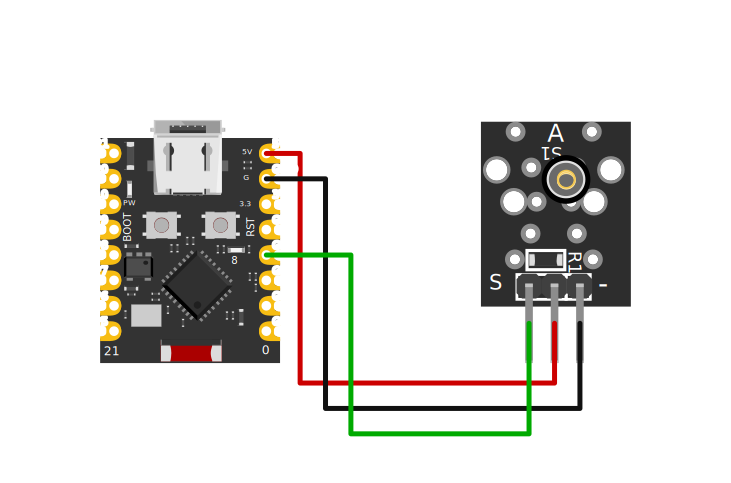

#### Compatible pins

Any safe-to-use digital pin: **`GPIO3`–`GPIO7`, `GPIO10`, `GPIO20`, `GPIO21`**.

### Tilt switch (ball)

A ball-in-tube tilt sensor (Elegoo KY-020). A small metal ball rolls between two contacts depending on orientation — the switch is closed one way, open the other. Behaves electrically like a button: HIGH idle, LOW when tilted (or vice-versa depending on how you mount it).

Typical uses: "prop tipped over" detection, orientation-gated triggers, anti-theft.

3-pin module (`S`, middle = power, `-`).

#### Wiring

| Module pin | ESP32-C3 pin | Notes                                    |
|------------|--------------|------------------------------------------|
| middle     | `3V3`        | 3.3 V. Also accepts 5 V.                 |
| `-`        | `GND`        |                                          |
| `S`        | `GPIO3` (default) | State flips with orientation.       |

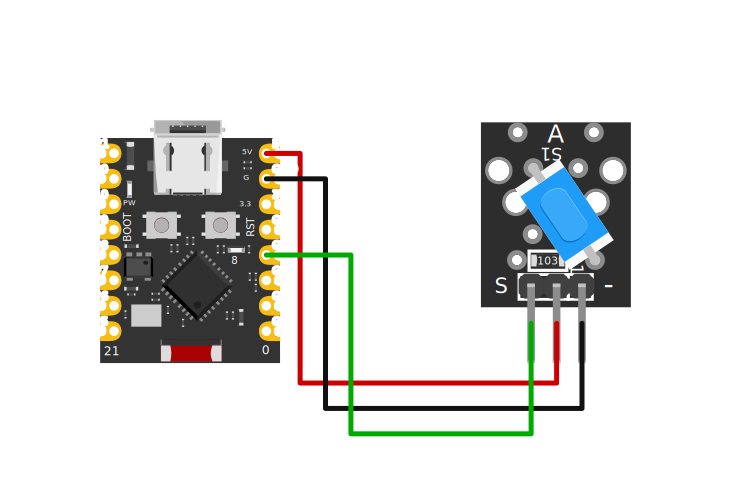

#### Compatible pins

Same as Button. Any safe-to-use digital pin: `GPIO3`–`GPIO7`, `GPIO10`, `GPIO20`, `GPIO21`.

### Tilt switch (mercury)

An older-style tilt sensor (Elegoo KY-017) using a sealed mercury capsule. Wires up and behaves like the ball tilt switch, but responds faster and more repeatably. Dispose of broken units responsibly — the capsule contains mercury.

3-pin module (`S`, middle = power, `-`).

#### Wiring

| Module pin | ESP32-C3 pin | Notes                                    |
|------------|--------------|------------------------------------------|
| middle     | `3V3`        | 3.3 V. Also accepts 5 V.                 |
| `-`        | `GND`        |                                          |
| `S`        | `GPIO3` (default) | State flips with orientation.       |

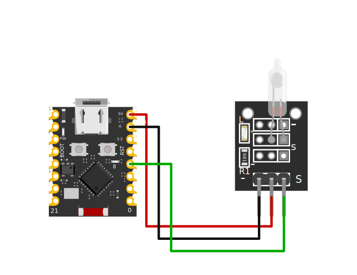

#### Compatible pins

Same as Button. Any safe-to-use digital pin: `GPIO3`–`GPIO7`, `GPIO10`, `GPIO20`, `GPIO21`.

### Reed switch (large)

A magnetically-activated switch on a breakout board (Elegoo KY-025). Inside a small glass tube, two contacts close when a magnet is near. The board has a tuning screw and gives you two outputs: `A0` (analog — mostly used for fine-tuning the threshold) and `D0` (digital — goes LOW when a magnet is present).

Typical uses: door / drawer / lid sensors (glue a magnet to the lid, stick the reed module on the frame), hidden magnet-activated triggers.

4-pin module (`A0`, `G`, `+`, `D0`). The diagram wires the analog pin; use `D0` instead if you just need "magnet present / not."

#### Wiring

| Module pin | ESP32-C3 pin | Notes                                                |
|------------|--------------|------------------------------------------------------|
| `+`        | `3V3`        | 3.3 V. Also accepts 5 V.                             |
| `G`        | `GND`        |                                                      |
| `A0`       | `GPIO2` (default) | Analog voltage. Needs an analog-capable pin.    |
| `D0`       | any safe digital pin (optional) | Digital output (LOW when magnet is near). |

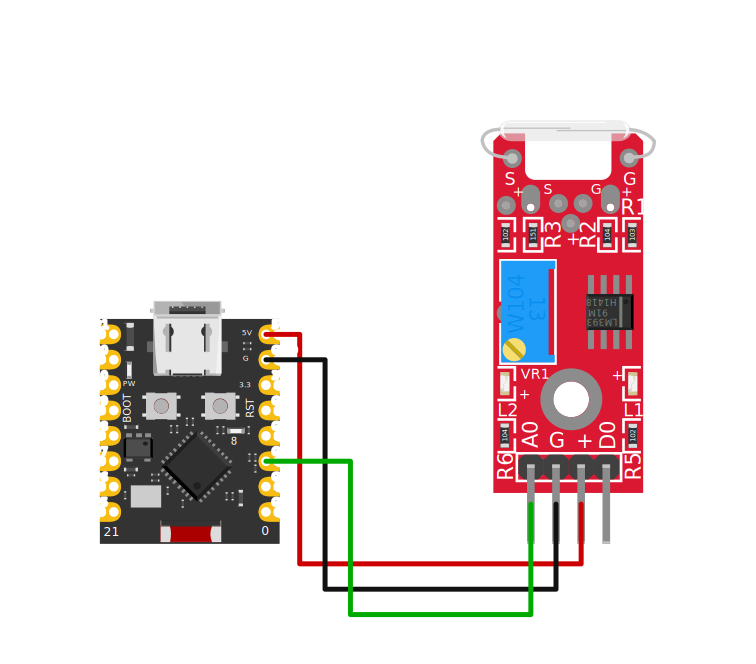

#### Compatible pins

For the `A0` analog output: any analog-capable pin — **`GPIO0`, `GPIO1`, `GPIO2`, `GPIO3`, `GPIO4`**. For the `D0` digital output: any safe-to-use digital pin — `GPIO3`–`GPIO7`, `GPIO10`, `GPIO20`, `GPIO21`.

### Mini reed switch

A simpler reed-switch breakout (Elegoo KY-021). No tuning screw, no analog pin — just direct digital output: HIGH or LOW depending on whether a magnet is near the reed.

Typical uses: same as the large reed switch, but smaller and when you only need the digital answer.

3-pin module (`S`, middle = power, `-`).

#### Wiring

| Module pin | ESP32-C3 pin | Notes                                     |
|------------|--------------|-------------------------------------------|
| middle     | `3V3`        | 3.3 V. Also accepts 5 V.                  |
| `-`        | `GND`        |                                           |
| `S`        | `GPIO3` (default) | HIGH/LOW depending on magnet.        |

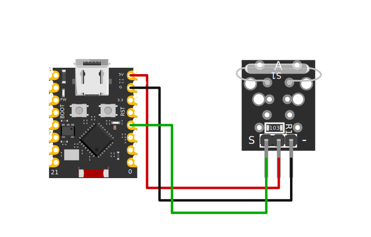

#### Compatible pins

Any safe-to-use digital pin: `GPIO3`–`GPIO7`, `GPIO10`, `GPIO20`, `GPIO21`.

### Metal touch

A touch-sensitive pad (Elegoo KY-036). Two metal pads sit next to each other; when a finger (or a wire soldered to the pad and taped under a prop surface) bridges them, the module's `D0` output flips LOW. A tuning screw adjusts how sensitive it is.

Typical uses: "touch the skull to start the effect," hidden touch triggers under paint or thin fabric.

4-pin module (`A0`, `G`, `+`, `D0`). Your code usually reads the digital pin (`D0`); the analog pin is useful for tuning the threshold.

#### Wiring

| Module pin | ESP32-C3 pin | Notes                                         |
|------------|--------------|-----------------------------------------------|
| `+`        | `3V3`        | 3.3 V. Also accepts 5 V.                      |
| `G`        | `GND`        |                                               |
| `D0`       | `GPIO3` (default) | Digital — LOW on touch (tunable).        |
| `A0`       | any analog pin (optional) | Raw analog for threshold tuning.  |

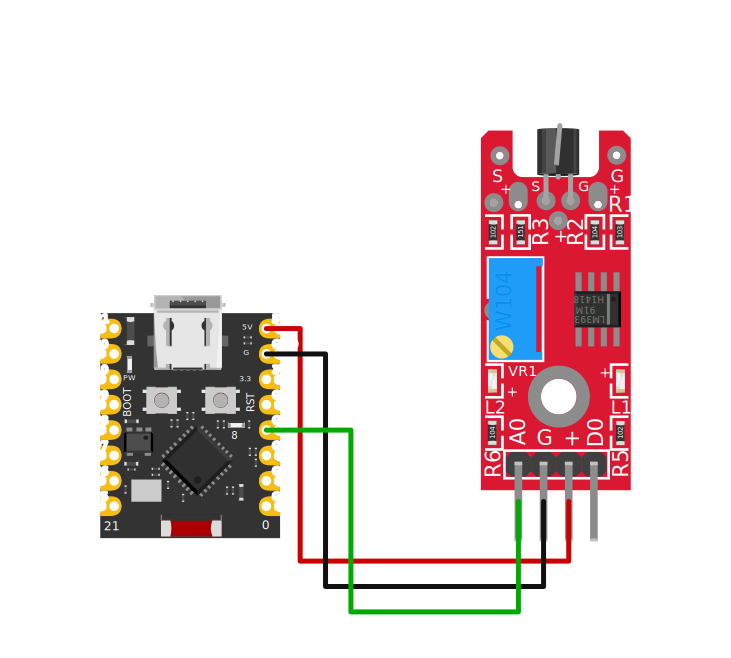

#### Compatible pins

`D0`: any safe-to-use digital pin — `GPIO3`–`GPIO7`, `GPIO10`, `GPIO20`, `GPIO21`. `A0`: any analog-capable pin (`GPIO0`–`GPIO4`).

### Joystick

A dual-axis joystick with a push-button (Elegoo KY-023). Moving the stick produces two analog voltages (one per axis); pressing the stick closes a switch to ground.

Typical uses: diagnostics / tuning UI, operator hand-held control panel, on-the-fly effect aiming.

5-pin module (`GND`, `+5V`, `VRx`, `VRy`, `SW`). The two axes each need an analog-capable pin; the button can go on any digital pin.

#### Wiring

| Module pin | ESP32-C3 pin | Notes                                          |
|------------|--------------|------------------------------------------------|
| `+5V`      | `3V3`        | Works on 3.3 V (with a slightly smaller range).|
| `GND`      | `GND`        |                                                |
| `VRx`      | `GPIO2` (default) | X axis, analog.                           |
| `VRy`      | `GPIO3` (default) | Y axis, analog.                           |
| `SW`       | `GPIO5` (default) | Push-to-click, LOW when pressed.          |

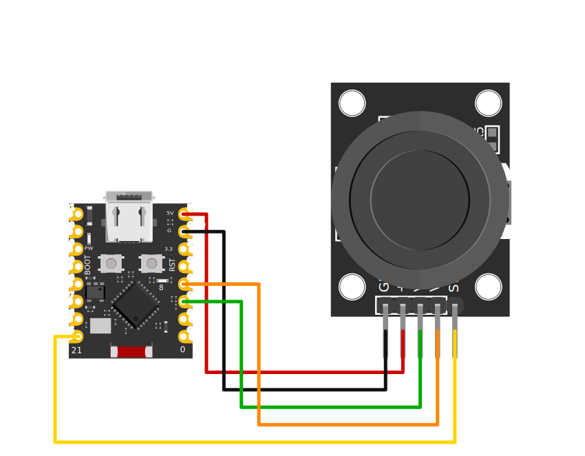

#### Compatible pins

`VRx` / `VRy`: any two analog-capable pins (`GPIO0`–`GPIO4`). Prefer `GPIO2` + `GPIO3` or `GPIO3` + `GPIO4`. `SW`: any safe-to-use digital pin — `GPIO4`–`GPIO7`, `GPIO10`, `GPIO20`, `GPIO21`. Don't re-use an analog pin for `SW`.

### Photoresistor

An analog light sensor (Elegoo KY-018). The sensing element changes its resistance with the amount of light hitting it, and the board converts that into a voltage your code reads on an analog pin: brighter light → higher voltage (or lower, depending on how the board is wired).

Typical uses: detecting when a lid is opened, when a room light turns on, when a UV blacklight hits a prop.

3-pin module (`S`, middle = power, `-`). Because the output is analog, the signal pin **must** be an analog-capable pin.

#### Wiring

| Module pin | ESP32-C3 pin | Notes                                             |
|------------|--------------|---------------------------------------------------|
| middle     | `3V3`        | 3.3 V. The module also accepts 5 V.               |
| `-`        | `GND`        |                                                   |
| `S`        | `GPIO2` (default) | Analog voltage. Read it as an analog input.  |

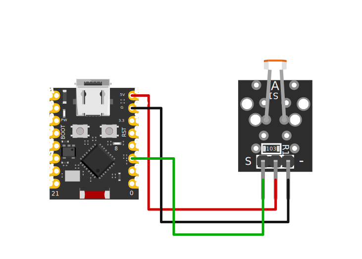

#### Compatible pins

Any analog-capable pin: **`GPIO0`, `GPIO1`, `GPIO2`, `GPIO3`, `GPIO4`**. Prefer `GPIO2`, `GPIO3`, `GPIO4`. `GPIO0` and `GPIO1` also work but can pick up a little more noise.

### Photo-interrupter

An optical slot sensor (Elegoo KY-010). An infrared LED faces a light sensor across a ~5 mm gap; when something opaque slips into the slot, the beam is broken and the digital output flips. Think of it as a "something moved through this slot" detector.

Typical uses: end-stop sensing on moving props, coin-slot / token detection, rotation counting with a slotted disc on a shaft.

3-pin module (`S`, middle = power, `-`).

#### Wiring

| Module pin | ESP32-C3 pin | Notes                                                |
|------------|--------------|------------------------------------------------------|
| middle     | `3V3`        | 3.3 V. Also accepts 5 V.                             |
| `-`        | `GND`        |                                                      |
| `S`        | `GPIO3` (default) | HIGH when the slot is clear, LOW when blocked.  |

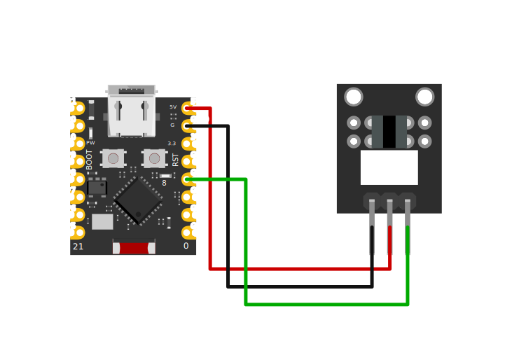

#### Compatible pins

Any safe-to-use digital pin: `GPIO3`–`GPIO7`, `GPIO10`, `GPIO20`, `GPIO21`.

### Flame sensor

A narrow-angle infrared flame detector (Elegoo KY-026). It picks up the particular kind of infrared light small flames give off. `A0` is the raw analog reading (how much "flame-like" light it sees); `D0` is the digital pin that flips LOW once the reading crosses a threshold you set with a tuning screw.

Typical uses: safety interlocks around fire effects, candle-out detection, campfire-themed props that react to a real flame.

4-pin module (`A0`, `G`, `+`, `D0`). The diagram wires the analog output.

#### Wiring

| Module pin | ESP32-C3 pin | Notes                                        |
|------------|--------------|----------------------------------------------|
| `+`        | `3V3`        | 3.3 V. Also accepts 5 V.                     |
| `G`        | `GND`        |                                              |
| `A0`       | `GPIO2` (default) | Analog flame intensity.                 |
| `D0`       | any safe digital pin (optional) | LOW once threshold is crossed. |

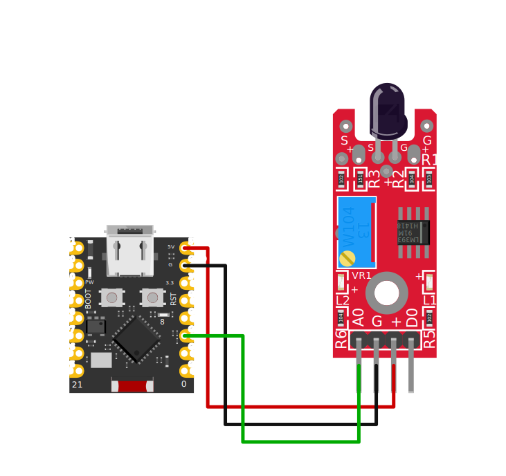

#### Compatible pins

`A0`: any analog-capable pin (`GPIO0`–`GPIO4`), prefer `GPIO2`–`GPIO4`. `D0`: any safe-to-use digital pin — `GPIO3`–`GPIO7`, `GPIO10`, `GPIO20`, `GPIO21`.

### Digital hall sensor

A magnetic proximity sensor with a digital output (Elegoo KY-003). The chip switches its output LOW when a strong enough magnet is near. It only triggers on one magnetic pole — the other pole does nothing — so orient your magnet accordingly.

Typical uses: contactless "magnet-key" triggers, rotation counting with a magnet on a shaft, hidden proximity switches.

3-pin module (`S`, middle = power, `-`).

#### Wiring

| Module pin | ESP32-C3 pin | Notes                                               |
|------------|--------------|-----------------------------------------------------|
| middle     | `3V3`        | 3.3 V. Also accepts 5 V.                            |
| `-`        | `GND`        |                                                     |
| `S`        | `GPIO3` (default) | LOW when the correct magnet pole is near.      |

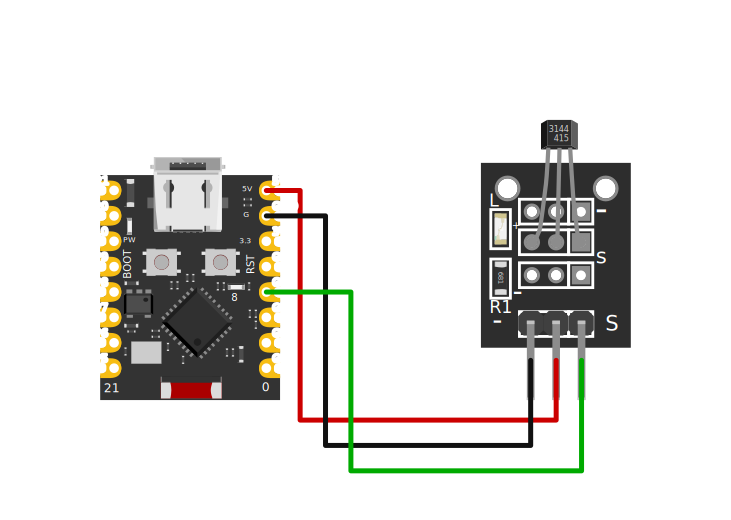

#### Compatible pins

Any safe-to-use digital pin: `GPIO3`–`GPIO7`, `GPIO10`, `GPIO20`, `GPIO21`.

### Linear (analog) hall sensor

A magnetic sensor with an analog output (Elegoo KY-024). Instead of a simple on/off answer, this one reports magnet strength continuously: the voltage sits in the middle when there's no magnet, and shifts up or down depending on which pole is near and how close it is. The board also provides a digital pin for a simple "magnet past threshold" signal.

Typical uses: distance-to-magnet estimation, magnetic "dial" inputs, detecting both polarity and strength.

4-pin module (`A0`, `G`, `+`, `D0`).

#### Wiring

| Module pin | ESP32-C3 pin | Notes                                              |
|------------|--------------|----------------------------------------------------|
| `+`        | `3V3`        | 3.3 V. Also accepts 5 V.                           |
| `G`        | `GND`        |                                                    |
| `A0`       | `GPIO2` (default) | Analog — centered around mid-range.           |
| `D0`       | any safe digital pin (optional) | Digital threshold output.      |

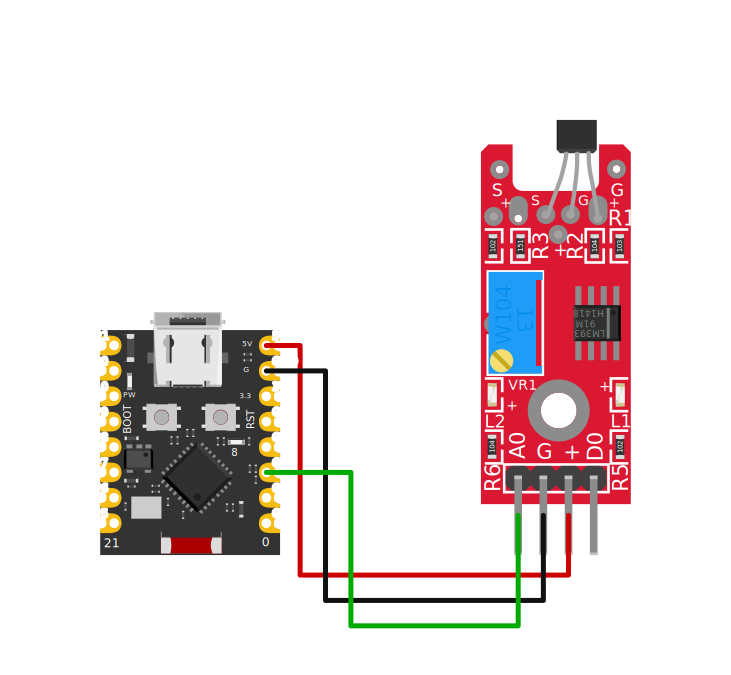

#### Compatible pins

`A0`: any analog-capable pin (`GPIO0`–`GPIO4`). `D0`: any safe-to-use digital pin — `GPIO3`–`GPIO7`, `GPIO10`, `GPIO20`, `GPIO21`.

### Analog thermistor

A simple temperature sensor (Elegoo KY-013). It uses a temperature-sensitive resistor whose resistance drops as it gets warmer; the board turns that into a voltage you read on an analog pin. A thermistor library converts the reading into °C for you.

Typical uses: rough ambient temperature, "is the prop warming up" sensing when ±2 °C accuracy is fine.

3-pin module (`S`, middle = power, `-`).

#### Wiring

| Module pin | ESP32-C3 pin | Notes                                              |
|------------|--------------|----------------------------------------------------|
| middle     | `3V3`        | 3.3 V. Also accepts 5 V.                           |
| `-`        | `GND`        |                                                    |
| `S`        | `GPIO2` (default) | Analog voltage that varies with temperature.  |

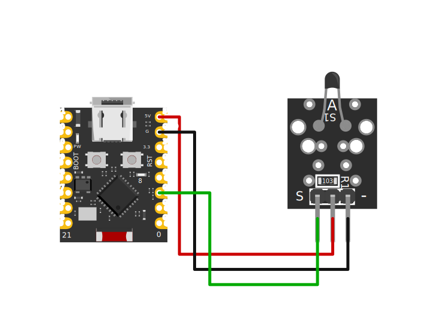

#### Compatible pins

Any analog-capable pin: **`GPIO0`–`GPIO4`**. Prefer `GPIO2`, `GPIO3`, `GPIO4`.

### Digital thermistor (thresholded)

A thermistor breakout with a built-in threshold chip (Elegoo KY-028). Same temperature sensor as KY-013, but a tuning screw sets a trip temperature and the board gives you both an analog pin (raw reading) and a digital pin that goes LOW once the trip point is crossed.

Typical uses: "too hot" / "too cold" alarms, simple thermostat logic without writing threshold code.

4-pin module (`A0`, `G`, `+`, `D0`).

#### Wiring

| Module pin | ESP32-C3 pin | Notes                                       |
|------------|--------------|---------------------------------------------|
| `+`        | `3V3`        | 3.3 V. Also accepts 5 V.                    |
| `G`        | `GND`        |                                             |
| `A0`       | `GPIO2` (default) | Raw analog temperature.                |
| `D0`       | any safe digital pin (optional) | Flips LOW past the threshold. |

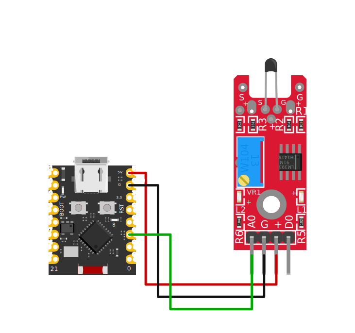

#### Compatible pins

`A0`: any analog-capable pin (`GPIO0`–`GPIO4`). `D0`: any safe-to-use digital pin — `GPIO3`–`GPIO7`, `GPIO10`, `GPIO20`, `GPIO21`.

### Line tracker

A downward-looking light sensor (Elegoo KY-033). An infrared LED shines downward and a light sensor measures what bounces back: white / shiny surfaces reflect a lot of light, black / matte surfaces very little. The board converts this into a digital output, with a tuning screw for the threshold.

Typical uses: line-following robots, edge-of-table detection, "is the prop on the pedestal" checks.

3-pin module (`S`, `V+`, `GND`).

#### Wiring

| Module pin | ESP32-C3 pin | Notes                                                 |
|------------|--------------|-------------------------------------------------------|
| `V+`       | `3V3`        | 3.3 V. Also accepts 5 V.                              |
| `GND`      | `GND`        |                                                       |
| `S`        | `GPIO3` (default) | Digital — LOW over dark, HIGH over light (tunable).|

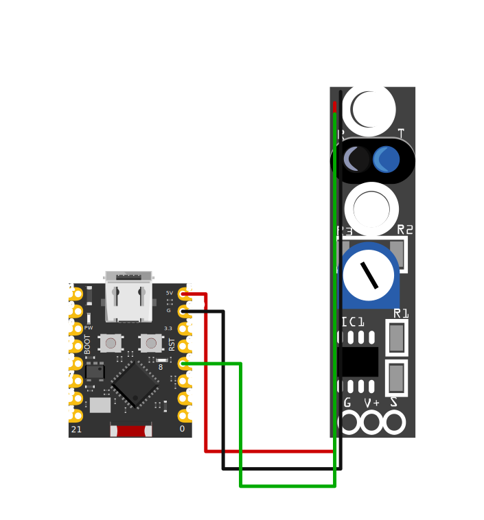

#### Compatible pins

Any safe-to-use digital pin: `GPIO3`–`GPIO7`, `GPIO10`, `GPIO20`, `GPIO21`.

### IR receiver

An infrared remote-control receiver (Elegoo KY-022) — the same kind of sensor a TV uses to read its remote. It handles the tricky signal decoding for you; your code sees a clean data stream on one pin, which an IR library (such as `IRremote` or `IRremoteESP8266`) turns into button codes.

Typical uses: remote-controlled prop activation, hidden IR trigger (point any IR remote at the sensor), decoding commands from a fob you hand to the guest.

3-pin module (`S`, middle = power, `-`).

#### Wiring

| Module pin | ESP32-C3 pin | Notes                                        |
|------------|--------------|----------------------------------------------|
| middle     | `3V3`        | 3.3 V. Also accepts 5 V.                     |
| `-`        | `GND`        |                                              |
| `S`        | `GPIO20` (default) | Data pin (read with an IR library).     |

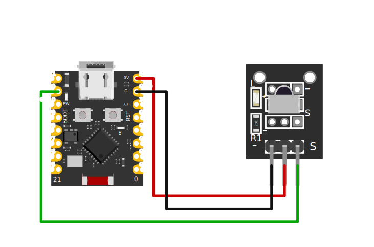

#### Compatible pins

Any safe-to-use digital pin: `GPIO3`–`GPIO7`, `GPIO10`, `GPIO20`, `GPIO21`.

### DHT temperature & humidity

A combined temperature + humidity sensor (Elegoo KY-015, using the DHT11 chip). Talks over a single data pin using its own custom timing. You can't read it with a plain digitalRead — use a DHT library (it handles the timing for you). The DHT11 samples about once per second; don't poll faster.

Typical uses: room climate logging, "is the fog machine room getting humid" alerts, environmental effects driven by real conditions.

3-pin module (`S`, `Vin`, `-`).

#### Wiring

| Module pin | ESP32-C3 pin | Notes                                                      |
|------------|--------------|------------------------------------------------------------|
| `Vin`      | `3V3`        | 3.3 V. DHT11 works from 3 to 5.5 V.                        |
| `-`        | `GND`        |                                                            |
| `S`        | `GPIO2` (default) | Data pin (read with a DHT library).                   |

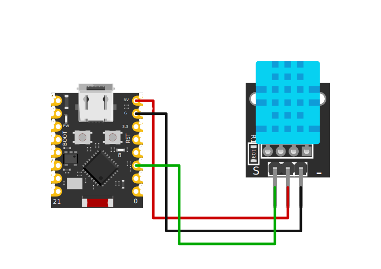

#### Compatible pins

Any safe-to-use digital pin: `GPIO3`–`GPIO7`, `GPIO10`, `GPIO20`, `GPIO21`.

### DS18B20 digital temperature

A digital temperature sensor that talks over a single data pin (the "1-Wire" bus — one-wire for data, plus power and ground). Accurate to about ±0.5 °C, sends its reading in digital form (no calibration needed), and you can daisy-chain several of them on the same data pin — each one has a unique built-in address.

Typical uses: ambient temperature in a prop or room, "hand on the object" heat detection, temperature-driven effects.

The Elegoo breakout is 3-pin (`S`, `VCC`, `GND`). The resistor 1-Wire needs is already on the board — you don't need to add one.

#### Wiring

| Module pin | ESP32-C3 pin | Notes                              |
|------------|--------------|------------------------------------|
| `VCC`      | `3V3`        | 3.3 V. The sensor also accepts 5 V.|
| `GND`      | `GND`        |                                    |
| `S`        | `GPIO2` (default) | Data pin (1-Wire library).    |

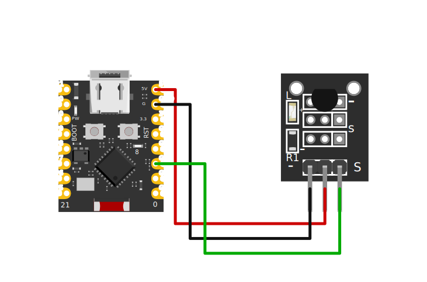

#### Compatible pins

Any safe-to-use digital pin: **`GPIO3`, `GPIO4`, `GPIO5`, `GPIO6`, `GPIO7`, `GPIO10`, `GPIO20`, `GPIO21`**.

### Sound sensor (sensitive microphone)

A microphone board with a threshold detector (Elegoo KY-037, the larger / more sensitive variant). A small microphone picks up sound; an on-board chip amplifies it and a tuning screw sets a loudness threshold. `A0` gives you the full analog waveform; `D0` goes LOW when the sound crosses the threshold — i.e., "something loud happened."

Typical uses: clap-to-trigger, scream-activated effects, scene-audio-driven props.

4-pin module (`A0`, `G`, `+`, `D0`). If you read the analog pin, sample it quickly (a few thousand times per second) to catch short peaks.

#### Wiring

| Module pin | ESP32-C3 pin | Notes                                         |
|------------|--------------|-----------------------------------------------|
| `+`        | `3V3`        | 3.3 V. Also accepts 5 V.                      |
| `G`        | `GND`        |                                               |
| `A0`       | `GPIO2` (default) | Amplified analog microphone signal.      |
| `D0`       | any safe digital pin (optional) | LOW on loud sound.         |

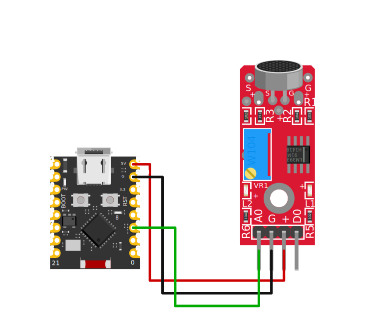

#### Compatible pins

`A0`: any analog-capable pin (`GPIO0`–`GPIO4`). `D0`: any safe-to-use digital pin — `GPIO3`–`GPIO7`, `GPIO10`, `GPIO20`, `GPIO21`.

### Sound sensor (small microphone)

A smaller / less-sensitive microphone board (Elegoo KY-038). Same idea as KY-037 — mic, amplifier, tuning screw, analog and digital outputs — but tuned for louder / closer sounds. Wires up the same way.

Typical uses: "shout to open" triggers where you want to filter out ambient room noise.

4-pin module (`A0`, `G`, `+`, `D0`).

#### Wiring

| Module pin | ESP32-C3 pin | Notes                                         |
|------------|--------------|-----------------------------------------------|
| `+`        | `3V3`        | 3.3 V. Also accepts 5 V.                      |
| `G`        | `GND`        |                                               |
| `A0`       | `GPIO2` (default) | Analog microphone signal.                |
| `D0`       | any safe digital pin (optional) | LOW on loud sound.         |

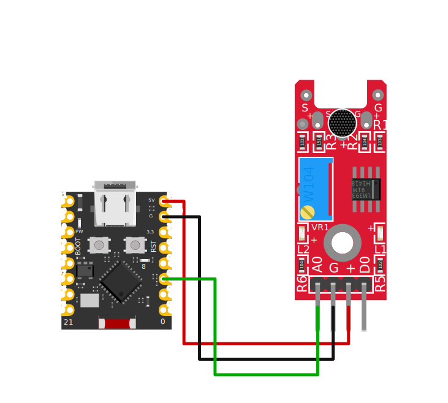

#### Compatible pins

Same as KY-037. `A0`: `GPIO0`–`GPIO4`. `D0`: any safe-to-use digital pin.

---

## Output modules

### Active buzzer

A buzzer that makes its own tone (Elegoo KY-012). You don't generate the sound — just pull the signal pin HIGH and it buzzes at a fixed pitch (~2.5 kHz). One tone, one volume. Simpler than the passive buzzer, but you can't play melodies.

Typical uses: on/off beep alerts, "timer expired" sounds, basic error indication.

2-pin module (`S`, `-`).

#### Wiring

| Module pin | ESP32-C3 pin | Notes                                |
|------------|--------------|--------------------------------------|
| `-`        | `GND`        |                                      |
| `S`        | `GPIO20` (default) | HIGH = buzz, LOW = silent.      |

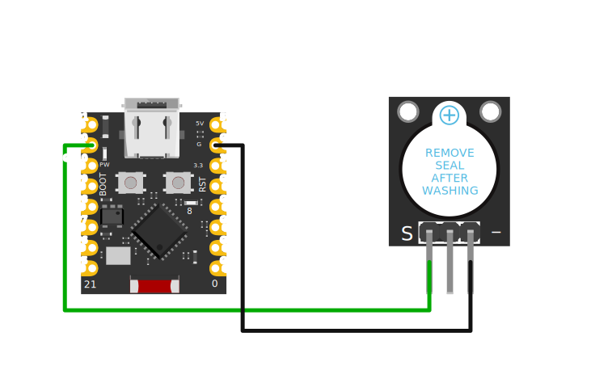

#### Compatible pins

Any safe-to-use digital pin: `GPIO3`–`GPIO7`, `GPIO10`, `GPIO20`, `GPIO21`.

### Passive buzzer

A small piezo speaker with no built-in tone (Elegoo KY-006). You drive it with a PWM signal — the frequency of the signal sets the pitch. Unlike the active buzzer, it stays silent if you just pull the pin HIGH; you need to toggle it (PWM or Arduino's `tone()` function) to make sound.

Typical uses: tuneful alerts, simple melodies, tone-coded feedback (different pitches for different states).

2-pin module (`S`, `-`). No power pin — the signal pin drives the buzzer directly. Output volume is modest: fine for a prop, not for room-filling sound.

#### Wiring

| Module pin | ESP32-C3 pin | Notes                                                |
|------------|--------------|------------------------------------------------------|
| `-`        | `GND`        |                                                      |
| `S`        | `GPIO21` (default) | Drive with PWM or `tone()` (20 Hz – 20 kHz).    |

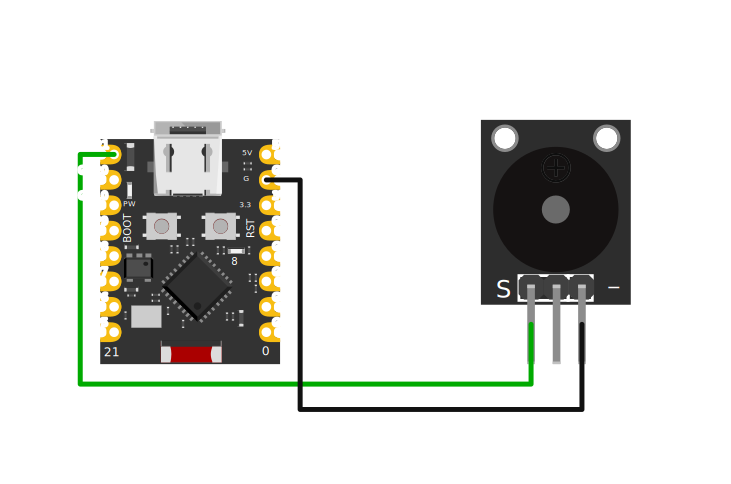

#### Compatible pins

Any safe-to-use digital pin: **`GPIO3`, `GPIO4`, `GPIO5`, `GPIO6`, `GPIO7`, `GPIO10`, `GPIO20`, `GPIO21`**.

### Laser

A tiny 5 mW red laser module (Elegoo KY-008). Pull the signal pin HIGH to turn the laser on, LOW to turn it off. Don't point it at eyes, and check local rules if you're shining it outside your own props.

Typical uses: laser-across-the-room beams paired with a photoresistor or photo-interrupter, targeting dots, "eye-beam" prop effects.

2-pin module (`S`, `-`).

#### Wiring

| Module pin | ESP32-C3 pin | Notes                                     |
|------------|--------------|-------------------------------------------|
| `-`        | `GND`        |                                           |
| `S`        | `GPIO9` (default) | HIGH = on. PWM works for dimming.    |

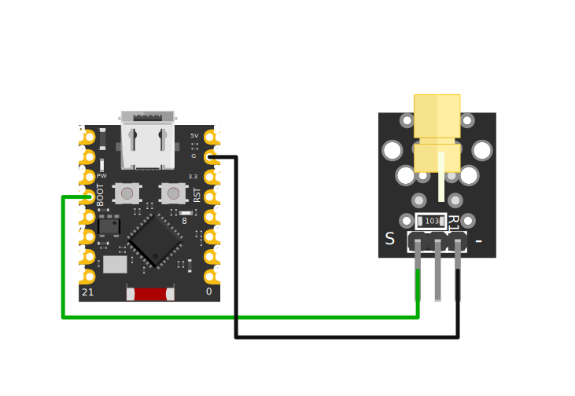

#### Compatible pins

Any safe-to-use digital pin: `GPIO3`–`GPIO7`, `GPIO10`, `GPIO20`, `GPIO21`. `GPIO9` works (it's the diagram's default) but is boot-sensitive — if the laser happens to be on at power-up, the board may not start. Safer to move it off `GPIO9` if you have a spare pin.

### SMD RGB LED

A small surface-mount RGB LED on a breakout (Elegoo KY-009). The LED has one shared minus pin and three separate pins for red, green, and blue. Drive each color with PWM to mix any color and brightness. Some revisions of the board don't include resistors — if the LED looks too dim or runs hot, add ~220 Ω resistors in series with each color pin.

Typical uses: prop status LEDs in any color, ambient lighting under a small decoration, eye glow.

4-pin module (`-`, `R`, `G`, `B`).

#### Wiring

| Module pin | ESP32-C3 pin | Notes                                |
|------------|--------------|--------------------------------------|
| `-`        | `GND`        | Shared minus pin.                    |
| `R`        | `GPIO9` (default)  | PWM for red.                    |
| `G`        | `GPIO10` (default) | PWM for green.                  |
| `B`        | `GPIO20` (default) | PWM for blue.                   |

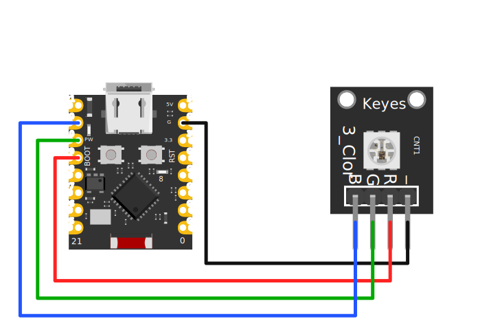

#### Compatible pins

Any three safe-to-use digital pins (PWM works on any of them). Prefer any three from: **`GPIO3`, `GPIO4`, `GPIO5`, `GPIO6`, `GPIO7`, `GPIO10`, `GPIO20`, `GPIO21`**. Avoid `GPIO9` (boot-sensitive) when you can.

### RGB LED (through-hole)

A taller through-hole RGB LED on a breakout (Elegoo KY-016), with resistors included. Same wiring and control as KY-009 — just the bigger, more visible package.

Typical uses: same as KY-009, but when you want a prominent, visible LED dome on the surface of a prop.

4-pin module (`-`, `R`, `G`, `B`).

#### Wiring

| Module pin | ESP32-C3 pin | Notes                                |
|------------|--------------|--------------------------------------|
| `-`        | `GND`        | Shared minus pin.                    |
| `R`        | `GPIO9` (default)  | PWM for red.                    |
| `G`        | `GPIO10` (default) | PWM for green.                  |
| `B`        | `GPIO20` (default) | PWM for blue.                   |

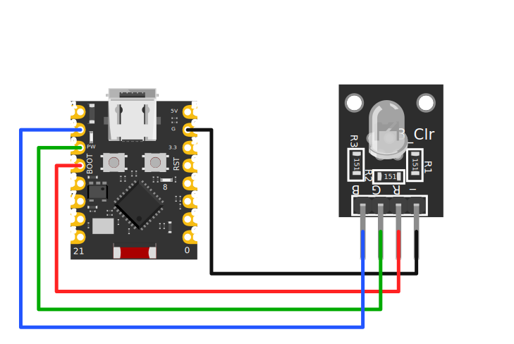

#### Compatible pins

Same as KY-009. Any three safe-to-use digital pins: `GPIO3`–`GPIO7`, `GPIO10`, `GPIO20`, `GPIO21`.

### Dual-color LED

A single LED with red and green dies in one package sharing a common pin (Elegoo KY-011). Driving one pin HIGH and the other LOW lights one color; swapping them lights the other; mixing with PWM gives yellow / orange shades in between.

Typical uses: pass/fail status (red/green), charging/charged indicators.

3-pin module (`S`, middle = shared, `-`). The diagram only wires one color for simplicity — add a second pin to control the other color independently.

#### Wiring

| Module pin | ESP32-C3 pin | Notes                                        |
|------------|--------------|----------------------------------------------|
| middle     | `3V3`        | Shared plus pin.                             |
| `-`        | `GND`        | (Or another GPIO if driving both colors.)    |
| `S`        | `GPIO3` (default) | Drive with HIGH/LOW or PWM.             |

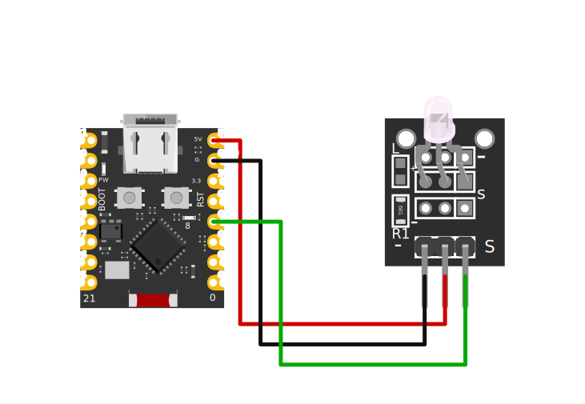

#### Compatible pins

Any safe-to-use digital pin (per color): `GPIO3`–`GPIO7`, `GPIO10`, `GPIO20`, `GPIO21`.

### Magic light cup

A pair of matching boards (sold as two; Elegoo KY-027). Each board has a mercury tilt switch and an LED. Tilt one and the LED on the *other* board lights — as if you'd poured light between cups. Each board exposes the tilt switch and the LED separately, so one ESP32-C3 can read both switches and drive both LEDs.

Typical uses: two-prop interactive puzzles ("pour the potion"), tandem tilt effects.

4 pins per board (`G`, `+`, `S`, `L`).

#### Wiring

| Module pin | ESP32-C3 pin | Notes                                          |
|------------|--------------|------------------------------------------------|
| `+`        | `3V3`        | 3.3 V. Also accepts 5 V.                       |
| `G`        | `GND`        |                                                |
| `S`        | `GPIO3` (default) | Digital tilt input.                       |
| `L`        | `GPIO4` (default) | Digital LED output (HIGH = on).           |

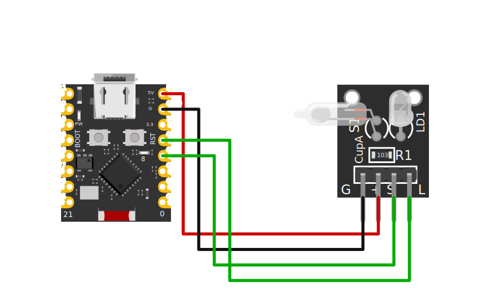

#### Compatible pins

Each board needs two safe-to-use digital pins (one input, one output). For the pair of boards, you'll need four pins total. Pick any from `GPIO3`–`GPIO7`, `GPIO10`, `GPIO20`, `GPIO21`.

### IR emitter

An infrared LED on a breakout (Elegoo KY-005). Paired with the IR receiver (KY-022), you can send custom remote-control codes from the ESP32-C3. An IR library (like `IRremote`) handles the signal shape for you.

Typical uses: triggering another IR-receiving prop wirelessly, controlling AV equipment, cross-prop sync.

3-pin module (`S`, middle = power, `-`).

#### Wiring

| Module pin | ESP32-C3 pin | Notes                                                |
|------------|--------------|------------------------------------------------------|
| middle     | `3V3`        | 3.3 V. Also accepts 5 V.                             |
| `-`        | `GND`        |                                                      |
| `S`        | `GPIO3` (default) | Driven by an IR library.                        |

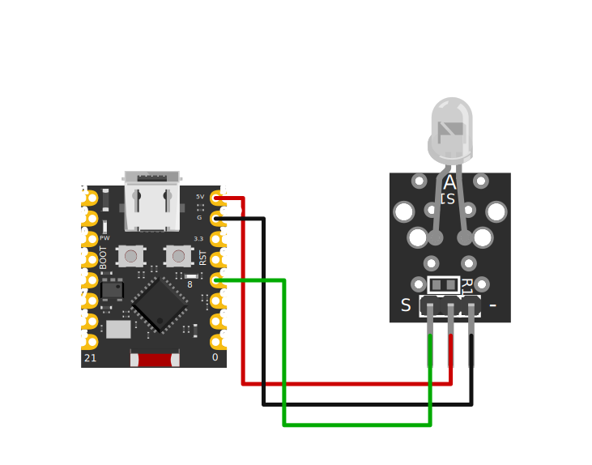

#### Compatible pins

Any safe-to-use digital pin: `GPIO3`–`GPIO7`, `GPIO10`, `GPIO20`, `GPIO21`.

### 1-channel relay

A mechanical relay with a driver circuit (Elegoo KY-019). A HIGH on the signal pin energizes the relay and closes its contacts; the high-voltage side is electrically separated from the ESP32-C3 side, so a short on the load won't damage the board. The contacts *can* switch mains, but that's only safe with a proper enclosure, strain relief, and wiring practice — **if you're new to mains voltage, stick to low-voltage DC loads.**

Typical uses: switching 12 V fog machines / prop motors, mains-powered lamps and pumps (inside an approved enclosure), any load too big for a GPIO to drive directly.

3-pin module (`+`, `-`, `S`). The relay coil draws about 70 mA — more than a GPIO can supply directly, but the board's built-in driver handles that as long as you feed 5 V to `+`.

#### Wiring

| Module pin | ESP32-C3 pin | Notes                                                        |
|------------|--------------|--------------------------------------------------------------|
| `+`        | `5V`         | **Use 5 V.** At 3.3 V the relay may not fully click in.      |
| `-`        | `GND`        |                                                              |
| `S`        | `GPIO2` (default) | HIGH = relay engaged. (Some boards are active-LOW — check.)|

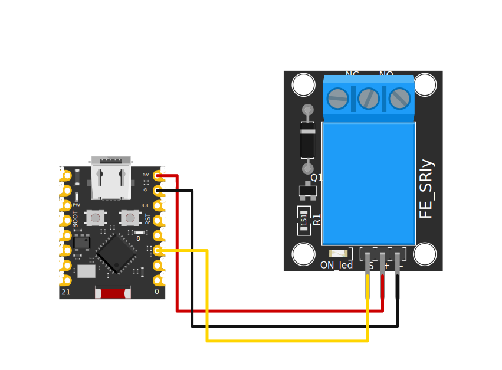

#### Compatible pins

Any safe-to-use digital pin: `GPIO3`–`GPIO7`, `GPIO10`, `GPIO20`, `GPIO21`. Avoid boot-sensitive pins (`GPIO0` / `GPIO2` / `GPIO8` / `GPIO9`) — if the pin floats HIGH at power-up, the relay may click on for a moment before your code takes over.
